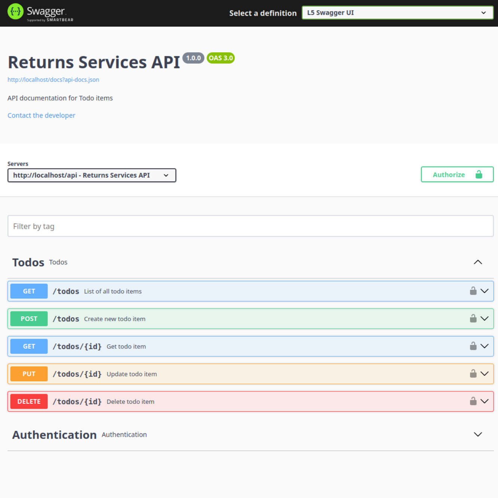

# PHP Laravel Challenge

Projeto desenvolvido para o desafio da Corelab.

## 🚀 Começando

Consulte **Instalação** para saber como instalar o projeto.

### 📋 Pré-requisitos

- PHP ^8.2 ou maior;
- Laravel Framework ^11;
- Laravel Sail (Docker);
- L5 Swagger;
- MariaDB ^11.0;
- NodeJs ^20.14.0 LTS;
- Npm ^10.7.0;
- Pest PHP for Tests;
- Redis;
- Composer ^2.8;

### 🔧 Instalação

Dentro da pasta do projeto, rode os comandos na ordem abaixo.

```
cp .env.example .env
```

```
docker compose up -d
```

```
./vendor/bin/sail composer install
```

```
./vendor/bin/sail artisan key:generate
```

```
./vendor/bin/sail artisan migrate
```

```
npm install && npm run dev
```

## 📝 Documentação da API com Swagger

Link: [http://localhost/api/documentation](http://localhost/api/documentation)




## 🧪 Testes

Utilize este comando para executar os testes.

```
./vendor/bin/sail pest
```

## 🛠️ Construído com

- [Laravel Framework 11](https://laravel.com/) - Framework
- [Laravel Sail (Docker)](https://laravel.com/docs/11.x/sail) - Ambiente
- [Pest PHP](https://pestphp.com/docs/plugins/laravel) - Pest PHP for Tests
- [MariaDB](https://mariadb.org/) - Banco de dados
- [Redis](https://redis.io/) - Cache

## ✒️ Autores

- **Kevin Smith** - _Desenvolvimento_ - [Kevin Smith](https://github.com/kevinsmitth)
